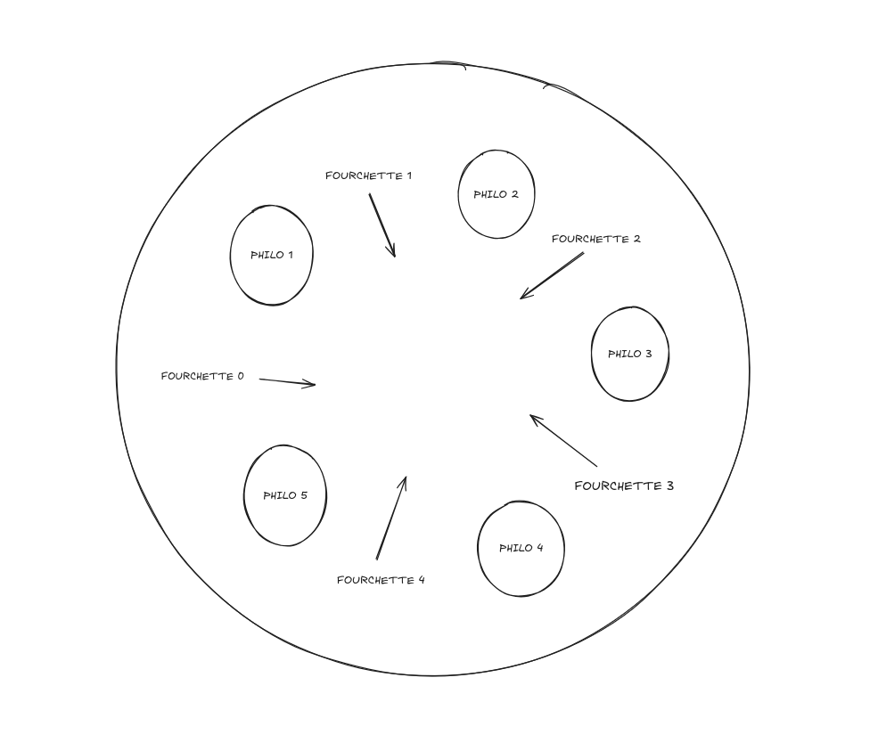

# 42 Project Philosophers 👋

> Philosophers is a 42 School project. In this project we need to make a funny simulation
> for learn threads.
> Philosopher is a reproduction of the **dining philosophers problem**.

## Concept :

Imagine five philosophers sitting around a circular table. Each philosopher has a plate of spaghetti in front of them. Between each pair of philosophers, there is a single fork. To eat, a philosopher must pick up the two forks on either side of their plate. The challenge is to design an algorithm that allows the philosophers to eat without causing a deadlock, where each philosopher holds one fork and waits indefinitely for the other.

In this project we learn 📚 :
- Threads
- Synchronisation
- Prevent to Deadlock
- Mutex
- if choose to do BONUS, you can learn Semaphores

## Correction :

Validated : **02/2025**
Grade : ✅ **100%** ✅

## Compile ⚙️ :

Linux or MacOS :
- Clone the repository project.
- Do `make` 
- Do `./philo Nb_philo Time_to_die Time_to_eat Time_to_sleep Nb_of_times_each_Philo_eat(optionnal)`

> Time_to_die : (in milliseconds) If a philosopher has not started eating within time_to_die milliseconds since their last meal or the start of the simulation,
> they die.

> Time_to_eat : (in milliseconds) The time it takes for a philosopher to eat. During that time, they will need to hold two fork.

> Time_to_sleep : (in milliseconds) The time a philosopher will spend sleeping.

> Nb_of_times_each_Philo_eat(optionnal) : If all philosophers have eaten at least number_of_times_each_philosopher_must_eat times, the simulation stops. 
> If not specified, the simulation stops when a philosopher dies.

## 🎉 You can admire this Beautiful Simulation ! 🎉

## Subject :

Link to the Philosophers Subject : [Subject](./subject.pdf)

## Author ✍️

**NaYruk, Mulhouse 42 Student**

* Github: [@NaYruk](https://github.com/NaYruk)
